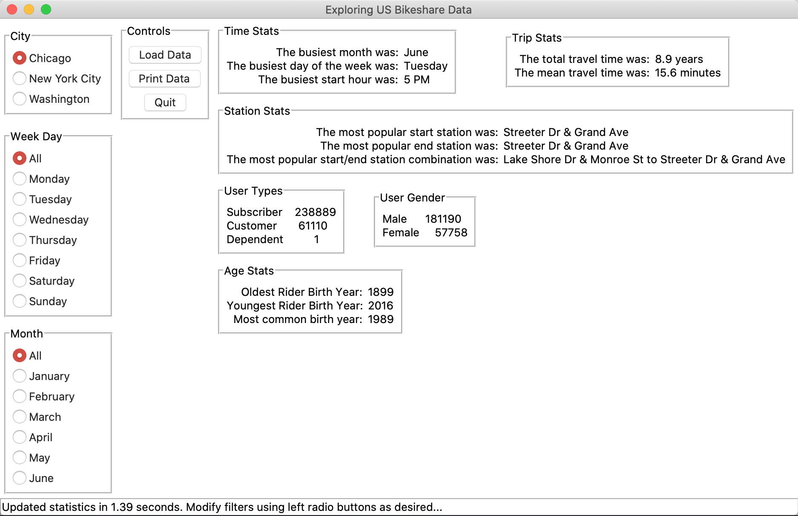

# Introduction

July 2020: The interactive exploration of US Bike Share data has been implemented in a simple GUI application using tkinter.

# Usage

## Dependencies

- Python 3

## Installation

Download csv files from Udacity with:

`$ sh install.sh`

## Run

Run the application with:

`$ python3 bikeshare.py`

## Operation

`bikeshare.py` loads data from:
- `chicago.csv`
- `new_york_city.csv`
- `washington.csv`
These files can be found in this archive from [Udacity](https://video.udacity-data.com/topher/2018/March/5aab379c_bikeshare-2/bikeshare-2.zip). The install.sh script downloads and unpacks them automatically.

The application window has:
- Radio buttons along the left side of the window for selecting filters
- A "Load Data" button for updating the statistics along the right side of the window
- A "Print Data" button to print the raw data in the terminal
- A "Quit" button to terminate the application

# Moving Forward

Most of the code in bikeshare.py defines the layout of the GUI. I've done my best to clean this code and break it out into smaller functions. If I were to futher develop this application, I would break this out into another module in order to make it more manageable.

# Credits

- [tkinter](https://docs.python.org/3/library/tkinter.html) has been used to produce the GUI.
- [Black](https://pypi.org/project/black/) has been used for code formatting.
- [Pylint](https://pylint.org/) has been used for style checking. 
    The following lints were set aside to maintain the simplicity of the project:
    - C0301: Line too long
    - R0913: Too many arguments
    - R0901: Too many ancestors
    - R0902: Too many instance attributes
